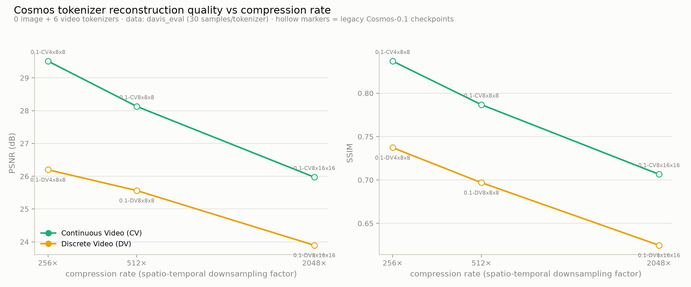
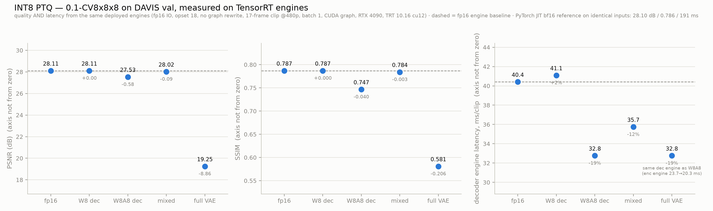

# Cosmos Tokenizer: compression–quality study and INT8/TensorRT deployment

Experiments on the Cosmos video tokenizer (the causal 3D-conv autoencoder shipped with
cosmos-predict1): how reconstruction quality trades against compression rate, what temporal
compression actually damages, how the officially published DAVIS numbers were measured, and
how far INT8 + TensorRT can push inference speed within a 1 dB quality budget.

All experiment code lives in [`eval_quality/`](eval_quality/) (usage:
[`eval_quality/README.md`](eval_quality/README.md); full findings and decision log:
[`eval_quality/quantization_research.md`](eval_quality/quantization_research.md)).
This is a fork of [nvidia-cosmos/cosmos-predict1](https://github.com/nvidia-cosmos/cosmos-predict1);
upstream code is unmodified.

Benchmarks: DAVIS 2017 val (30 clips, 480p, 17 frames) for the main harness; DAVIS 2016
(50 sequences, 1080p) for the official-protocol reproduction. GPU: RTX 4090 / 3090 (RunPod).

## 1. Quality vs compression rate

Six Cosmos-0.1 video tokenizers (continuous CV and discrete DV; compression = nominal
spatio-temporal downsampling):

- PSNR falls monotonically with compression; continuous beats discrete at every matched rate
  (CV: 29.5 → 28.1 → 26.0 dB; DV: 26.2 → 25.6 → 23.9 dB for 256× → 512× → 2048×).

## 2. Temporal compression selectively damages motion; spatial doesn't

Paired models isolate each axis (same 30 clips; motion score = mean |frame diff|):

| degradation (2× temporal vs 4× spatial) | low-motion | high-motion | ρ(motion, damage) |
|---|---|---|---|
| CV4x8x8 → CV8x8x8 (temporal ×2) | +1.03 dB (×1.27 MSE) | **+1.79 dB (×1.53 MSE)** | **+0.73** |
| CV8x8x8 → CV8x16x16 (spatial ×4) | +2.12 dB | +2.20 dB | −0.05 (flat) |

Per-clip extremes for the temporal step: static drift-chicane ×1.06 MSE vs fastest clip
shooting ×2.20. The DV family replicates the direction (ρ = +0.36 / −0.37).

## 3. The official DAVIS numbers are measured on H.264-recompressed content

Reproducing the published protocol (`eval_davis_official.py`, DAVIS 2016 / 1080p /
TokenBench video-MSE PSNR, 0.1-CV4x8x8) and toggling only where the H.264 round-trip
(mediapy default qp28) is applied:

| input / reconstruction | PSNR | SSIM |
|---|---|---|
| pristine / pristine | 32.42 | 0.893 |
| qp28 / qp28 (= the public CLI pipeline) | **32.77** | 0.904 |
| **official (paper / project page)** | **32.80** | 0.900 |

Input-side smoothing raises the score (+0.79 dB), output-side recompression lowers it
(−0.52 dB); the official pipeline does both. Any external comparison must replicate or
declare this.

## 4. INT8 PTQ + TensorRT: 3.67× at −0.62 dB

Layer-sensitivity scan → mixed-precision scheme (encoder keeps patcher/conv_in/down.0;
decoder fully INT8), exported as explicit Q/DQ ONNX and deployed with TensorRT 10:

Cumulative chain on one host (30 clips, end-to-end encode+decode):

| stage | ms/clip | speedup | PSNR |
|---|---|---|---|
| PyTorch JIT bf16 | 185.3 | 1× | 28.10 |
| TensorRT fp16 + CUDA graph | 61.4 | 3.02× | 28.11 |
| + INT8 (enc-mixed, dec-full) | 53.6 | 3.46× | 27.49 |
| + graph rewrite + opt5 | **50.5** | **3.67×** | 27.49 |

What worked: INT8 (−19% decoder), the numerically-exact graph rewrite (−8.5%, int8 only —
it unblocks Q/DQ fusion), encoder quantization (−12% encoder). What didn't (all measured):
weights-only W8 (±1%), SmoothQuant (no-op on conv nets), fp16 GroupNorm rewrite (+34%,
precision-broken), batch > 1 (+16%/clip), builder opt level 5 (<0.5%).

Quality side-notes: quantization damage is content-agnostic (×1.03–1.04 MSE across all
motion levels — complementary to temporal-compression damage, not compounding), and its
error is signal-correlated: reconstructions look slightly *sharper* than bf16 (edge-aligned
quantization noise acts like a mild unsharp mask) while PSNR/SSIM still drop.

## Repository layout

| path | contents |
|---|---|
| `eval_quality/*.py` | harness, registry, exports, TRT bench/eval/profile, plots |
| `eval_quality/results_full*/` | quality-vs-compression sweeps (per-clip samples + motion) |
| `eval_quality/results_davis_official/` | official-protocol runs incl. H.264 variants |
| `eval_quality/results_quant/` | PTQ ladder, sensitivity scans, visuals, figure |
| `eval_quality/results_trtfig/`, `results_e2e/` | TRT engine measurements, e2e ladder, profiles |
| `eval_quality/quantization_research.md` | findings, isolation matrices, pitfalls, decisions |
